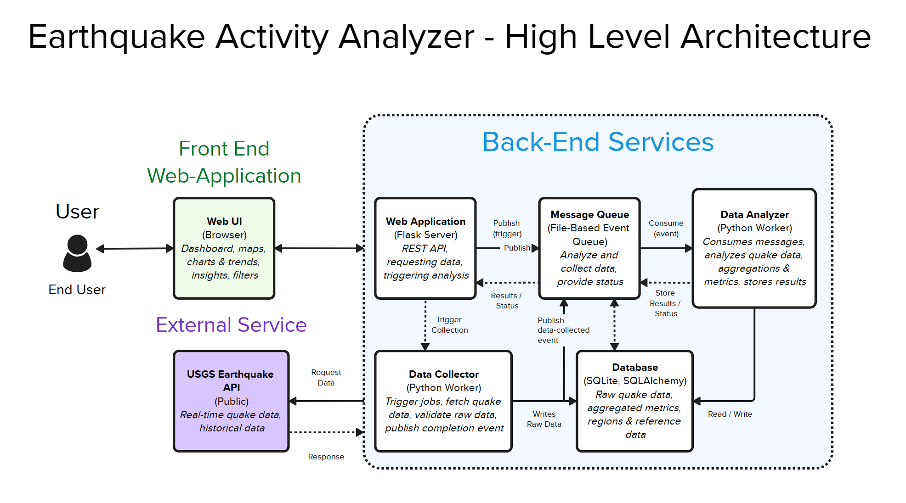

# **Earthquake Activity Analyzer Project** #

  This is a Flask-based web application that collects real-time earthquake data from the USGS API,
  stores it in a database, analyzes it, and present results through a web interface. The sytem
  demonstrates a simple distributed architecture with event-base communication, monitorning,
  testing, and CI/CD.

## **Heroku Link to Live Application** ##

  https://earthquake-analyzer-877958cebd07.herokuapp.com/

## Architecture Diagram

## **Project Rubric Mapping** ## 

Where to find each requirement within my application on the 'A Level Work' rubric, included to assist the grader

- ####  Web Application ####

      -implemented using Flask
      -Location: src/app.py
  
- ####  Data Collection ####

      -Fetches earthquake data from USGS API
      -Location: src/collector.py
  
- ####  Data Analyzer ####

      -Computes summary statistics (total, average, largest magnitude)
      -Location: src/analyzer.py
    
- ####  Unit Tests ####

      -Tests for collector and analyzer logic (4 total tests)
      -Location: test/
      
- ####  Data Persistence ####

      -Stores earthquake data in SQLite database using SQLAlchemy
      -Location: src/collector.py
        
- ####  Rest API Endpoints ####

      -/report -> returns earthquake analysis
      -/health -> application health status
      -/metrics -> request count
      -Location: src/app.py
          
- ####  Product Environment ####

      -Hosted on Heroku
      -Uses gunicorn to serve Flask app
      -Entry point: Procfile
            
- ####  Integration tests ####

      -Tests interaction between collector, database, and analyzer
      -Location: tests/test_integration.py
            
- ####  Mock Objects ####

      -API calls mocked using unittest.mock
      -Location: tests/test_collector.py
              
- ####  Continuous Integration ####

      -GitHub Actions pipeline runs tests on push
      -Location: .github/workflows/ci.yml
              
- ####  Production Monitoring ####

      -Health check endpoint
      -Location: /health in src/app.py
              
- ####  Instrumentation / Metrics ####

      -Tracks number of requests
      -Location: /metrics in src/app.py
              
- ####  Event collaboration messaging ####

      -File based message queue for communication between collector and analyzer
      -Location: tests/test_collector.py
            
- ####  Continuous Delivery ####

      -Automatic deployment from Github to Heroku
      -Configured in Heroku dashboard (auto deploy from main)
  
  
